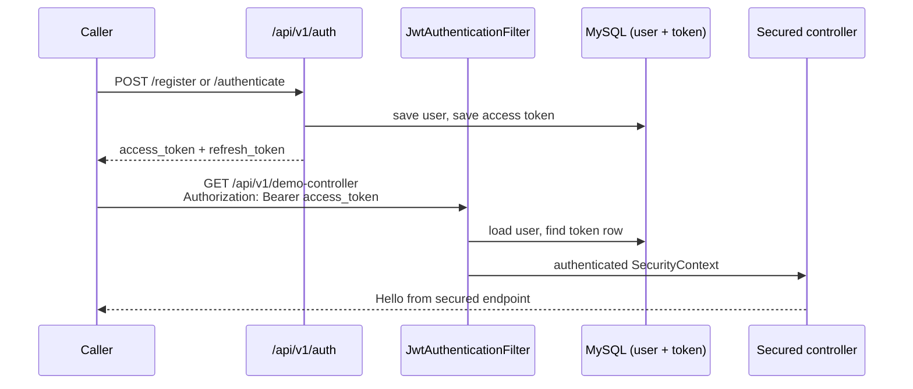

# Spring Boot 3 JWT Security

<p align="center">
  
</p>

<p align="center">
  <strong>One Spring Boot app. Signed tokens. Doors that only open with the right role.</strong><br>
  Register or log in, carry a Bearer JWT, and the filter decides which chamber you enter.
</p>

<p align="center">
  <a href="#meet-the-chambers">Meet the chambers</a> ·
  <a href="#how-a-request-is-checked">How a request is checked</a> ·
  <a href="#how-to-run">Run it</a> ·
  <a href="#api-reference">API reference</a> ·
  <a href="#tests">Tests</a>
</p>

---

A working Spring Boot 3 demo of **JWT authentication**, **refresh tokens**, **logout/revocation**, and **role / permission authorization**.

This repository shows:

- public **register** / **authenticate** / **refresh** endpoints
- a JWT filter that checks the signature **and** a row in the `token` table
- `USER`, `MANAGER`, and `ADMIN` roles with method-level permissions
- BCrypt passwords, change-password, and a small books API with JPA auditing

The app listens on **port 8001** (not 8080).

---

## Meet the chambers

Click a station. Start **MySQL** first, then the Spring Boot app, then call the cyan desk to get a gold token.

<table>
  <tr>
    <td align="center" width="33%">
      <a href="#authentication">
        
      </a><br>
      <strong><a href="#authentication">Authentication</a></strong><br>
      Register, login, refresh<br>
      <code>/api/v1/auth/**</code>
    </td>
    <td align="center" width="33%">
      <a href="#roles-and-permissions">
        
      </a><br>
      <strong><a href="#roles-and-permissions">Roles</a></strong><br>
      USER · MANAGER · ADMIN<br>
      steel / teal / violet
    </td>
    <td align="center" width="33%">
      <a href="#tokens">
        
      </a><br>
      <strong><a href="#tokens">Tokens</a></strong><br>
      Access (1 day) + refresh (7 days)<br>
      stored, then revoked
    </td>
  </tr>
</table>

| Piece | Path / name | Auth required? | Role |
|---|---|---|---|
| Register | `POST /api/v1/auth/register` | No | Public |
| Login | `POST /api/v1/auth/authenticate` | No | Public |
| Refresh | `POST /api/v1/auth/refresh-token` | Refresh token | Public |
| Logout | `POST /api/v1/auth/logout` | Access token | Any logged-in user |
| Demo | `GET /api/v1/demo-controller` | Access token | Any logged-in user |
| Books | `/api/v1/books` | Access token | Any logged-in user |
| Change password | `PATCH /api/v1/users` | Access token | Any logged-in user |
| Management | `/api/v1/management` | Access token | `ADMIN` or `MANAGER` |
| Admin | `/api/v1/admin` | Access token | `ADMIN` only |
| Swagger UI | `/swagger-ui/index.html` | No | Public |

On boot, a `CommandLineRunner` already mints two users:

| Email | Password | Role |
|---|---|---|
| `admin@mail.com` | `password` | `ADMIN` |
| `manager@mail.com` | `password` | `MANAGER` |

Their access tokens are printed in the startup log.

---

## How a request is checked

<p align="center">
  
</p>

A caller hits a secured door. The gold token is shown at the cyan filter. The filter checks the signature, expiry, and whether the token row is still valid. Then the role opens steel, teal, or violet.

```
curl / Postman / Swagger
      |
      |  Authorization: Bearer <access_token>
      v
 JwtAuthenticationFilter
      |
      |  1. Skip if path is /api/v1/auth/**
      |  2. Parse Bearer token
      |  3. Load user by email (JWT subject)
      |  4. Signature + expiry + token table (not expired, not revoked)
      v
 SecurityContext  (authorities from Role)
      |
      |  hasRole / hasAuthority
      v
 Controller  -->  200  or  403
```



Typical first-time timing:

1. MySQL is up and the `jwt_security` database exists.
2. The app starts on `:8001` and seeds `admin@mail.com` / `manager@mail.com`.
3. You register (or log in) and copy `access_token`.
4. `GET http://localhost:8001/api/v1/demo-controller` with `Authorization: Bearer …` returns `Hello from secured endpoint`.

If you call a secured path **without** a token, Spring Security answers **403**.

---

## Repository layout

```
spring-boot-3-jwt-security/
├── src/main/java/com/alibou/security/
│   ├── auth/            Register, login, refresh
│   ├── config/          JWT filter, SecurityFilterChain, JwtService
│   ├── user/            User, Role, Permission, change-password
│   ├── token/           Stored access tokens (revocation)
│   ├── demo/            Demo, management, admin controllers
│   ├── book/            Books + JPA auditing
│   └── auditing/        AuditorAware (createdBy / lastModifiedBy)
├── src/main/resources/application.yml
├── http/                IntelliJ HTTP samples (they still say :8080 — use :8001)
├── docs/images/         README illustrations
└── README.md
```

`docker-compose.yml` starts **Postgres**. This checkout’s `application.yml` talks to **MySQL**. Ignore Compose unless you switch the datasource back.

---

## Tech stack

| Piece | Version / choice |
|---|---|
| Language | Java 17 (`java.version` in `pom.xml`) |
| Runtime used here | **JDK 17** |
| Spring Boot | 3.1.4 |
| Security | `spring-boot-starter-security` + method security |
| JWT | `io.jsonwebtoken` 0.11.5 (HS256) |
| Passwords | BCrypt |
| Persistence | Spring Data JPA + MySQL 8 |
| API docs | springdoc-openapi 2.1.0 (Swagger UI) |
| Build | Maven 3.6+ (wrapper included) |
| Tests | JUnit 5 + `spring-boot-starter-test` |

Do **not** run this app on the machine’s default JDK 25. Spring Boot 3.1.4 is built for Java 17.

---

## Prerequisites

- JDK 17 on the `PATH` (or `JAVA_HOME` pointed at it)
- Maven 3.6+ (or `./mvnw`)
- MySQL 8+ listening on `localhost:3306`
- A database named **`jwt_security`**
- Free local port **8001**

On macOS:

```bash
export JAVA_HOME=$(/usr/libexec/java_home -v 17)
export PATH="$JAVA_HOME/bin:$PATH"
java -version
```

Create the schema (once):

```sql
CREATE DATABASE jwt_security;
```

Then put a MySQL user that actually works into `src/main/resources/application.yml`:

```yaml
spring:
  datasource:
    url: jdbc:mysql://localhost:3306/jwt_security
    username: <your-mysql-user>
    password: <your-mysql-password>
```

`ddl-auto` is `create-drop`, so tables are rebuilt on every process start. Users and tokens from the last run are gone.

---

## How to run

<p align="center">
  
</p>

Start **MySQL first**, then the app. The filter has nowhere to look up users if the database is down.

From the repository root:

```bash
export JAVA_HOME=$(/usr/libexec/java_home -v 17)
export PATH="$JAVA_HOME/bin:$PATH"

./mvnw spring-boot:run
```

Wait until the log shows:

```text
Started SecurityApplication
Admin token: eyJ...
Manager token: eyJ...
```

Then open:

- App: http://localhost:8001
- Swagger UI: http://localhost:8001/swagger-ui/index.html

Use Swagger’s **Authorize** button and paste `Bearer <access_token>` (or just the token, depending on the UI) after you register or log in.

---

## API reference

All secured calls send:

```http
Authorization: Bearer <access_token>
```

JSON field names in auth responses are `access_token` and `refresh_token`.

### Authentication


Public desk. No Bearer header on register or login. Refresh sends the **refresh** token, not the access token.

- Package: `com.alibou.security.auth`
- Base path: `/api/v1/auth`
- Filter: skipped (`JwtAuthenticationFilter` lets `/api/v1/auth/**` through)

<br clear="all">

#### 1. Register

Creates a user, encodes the password with BCrypt, mints access + refresh tokens, stores the access token.

| | |
|---|---|
| **Method** | `POST` |
| **URL** | `http://localhost:8001/api/v1/auth/register` |
| **Success** | `200 OK` |

```bash
curl -s -X POST http://localhost:8001/api/v1/auth/register \
  -H "Content-Type: application/json" \
  -d '{
    "firstname": "Ali",
    "lastname": "Bouali",
    "email": "ali@mail.com",
    "password": "password",
    "role": "ADMIN"
  }'
```

`role` is one of `USER`, `MANAGER`, `ADMIN`.

Example body:

```json
{
  "access_token": "eyJhbGciOiJIUzI1NiJ9...",
  "refresh_token": "eyJhbGciOiJIUzI1NiJ9..."
}
```

#### 2. Login

| | |
|---|---|
| **Method** | `POST` |
| **URL** | `http://localhost:8001/api/v1/auth/authenticate` |
| **Success** | `200 OK` |
| **Bad credentials** | `403` |

```bash
curl -s -X POST http://localhost:8001/api/v1/auth/authenticate \
  -H "Content-Type: application/json" \
  -d '{"email":"admin@mail.com","password":"password"}'
```

Login **revokes** every previous access token for that user, then stores the new one.

#### 3. Refresh token

| | |
|---|---|
| **Method** | `POST` |
| **URL** | `http://localhost:8001/api/v1/auth/refresh-token` |
| **Header** | `Authorization: Bearer <refresh_token>` |
| **Success** | `200 OK` with a new `access_token` |

```bash
curl -s -X POST http://localhost:8001/api/v1/auth/refresh-token \
  -H "Authorization: Bearer REFRESH_TOKEN"
```

#### 4. Logout

Marks the presented access token `expired` and `revoked`. The same Bearer value then fails the filter.

| | |
|---|---|
| **Method** | `POST` |
| **URL** | `http://localhost:8001/api/v1/auth/logout` |
| **Header** | `Authorization: Bearer <access_token>` |

```bash
curl -s -X POST http://localhost:8001/api/v1/auth/logout \
  -H "Authorization: Bearer ACCESS_TOKEN"
```

---

### Roles and permissions


Authorities come from `Role.getAuthorities()`: each permission string **plus** `ROLE_<NAME>`.

<br clear="all">

| Role | Doors that open |
|---|---|
| `USER` | Demo, books, change-password |
| `MANAGER` | Everything `USER` has, plus `/api/v1/management` |
| `ADMIN` | Everything `MANAGER` has, plus `/api/v1/admin` |

| Permission | Used on |
|---|---|
| `admin:read` / `admin:create` / `admin:update` / `admin:delete` | `AdminController` (`@PreAuthorize`) |
| `management:read` / `create` / `update` / `delete` | `/api/v1/management/**` in `SecurityFilterChain` |

#### Demo (any authenticated user)

```bash
curl -s http://localhost:8001/api/v1/demo-controller \
  -H "Authorization: Bearer ACCESS_TOKEN"
```

```text
Hello from secured endpoint
```

#### Management (`ADMIN` or `MANAGER`)

```bash
curl -s http://localhost:8001/api/v1/management \
  -H "Authorization: Bearer ACCESS_TOKEN"
```

```text
GET:: management controller
```

`POST` / `PUT` / `DELETE` on the same path exist for permission checks.

#### Admin (`ADMIN` only)

```bash
curl -s http://localhost:8001/api/v1/admin \
  -H "Authorization: Bearer ACCESS_TOKEN"
```

```text
GET:: admin controller
```

A `MANAGER` or `USER` token on `/api/v1/admin` should be **403**.

---

### Tokens


Access tokens are HS256 JWTs. Subject is the user’s **email**. They are also rows in the `token` table so logout can kill them before expiry.

<br clear="all">

| Setting | Value (`application.yml`) |
|---|---|
| Algorithm | HS256 |
| Access token TTL | `86400000` ms (1 day) |
| Refresh token TTL | `604800000` ms (7 days) |
| Secret | `application.security.jwt.secret-key` |

A request is accepted only if **all** of these are true:

1. `Authorization` starts with `Bearer `
2. JWT signature and expiry are valid
3. The email still exists
4. The matching `token` row is not `expired` and not `revoked`

---

### Books (JPA auditing)

Any authenticated user.

| | |
|---|---|
| **Create** | `POST /api/v1/books` → `202 Accepted` |
| **List** | `GET /api/v1/books` → `200 OK` |

```bash
curl -s -X POST http://localhost:8001/api/v1/books \
  -H "Authorization: Bearer ACCESS_TOKEN" \
  -H "Content-Type: application/json" \
  -d '{"author":"Alibou","isbn":"12345"}'

curl -s http://localhost:8001/api/v1/books \
  -H "Authorization: Bearer ACCESS_TOKEN"
```

`Book` records `createDate`, `lastModified`, `createdBy`, and `lastModifiedBy` via `AuditorAware`. Sending `"id": 1` on create updates that row.

### Change password

| | |
|---|---|
| **Method** | `PATCH` |
| **URL** | `http://localhost:8001/api/v1/users` |

```bash
curl -s -X PATCH http://localhost:8001/api/v1/users \
  -H "Authorization: Bearer ACCESS_TOKEN" \
  -H "Content-Type: application/json" \
  -d '{
    "currentPassword": "password",
    "newPassword": "newPassword",
    "confirmationPassword": "newPassword"
  }'
```

Then log in again with `newPassword`.

---

## Configuration

`src/main/resources/application.yml` (shape, not secrets):

```yaml
spring:
  datasource:
    url: jdbc:mysql://localhost:3306/jwt_security
    driver-class-name: com.mysql.cj.jdbc.Driver
    username: <your-mysql-user>
    password: <your-mysql-password>
  jpa:
    hibernate:
      ddl-auto: create-drop
    database: MYSQL

server:
  port: 8001

application:
  security:
    jwt:
      secret-key: <base64 HS256 key>
      expiration: 86400000
      refresh-token:
        expiration: 604800000
```

Public whitelist in `SecurityConfiguration`:

- `/api/v1/auth/**`
- OpenAPI / Swagger (`/v3/api-docs/**`, `/swagger-ui/**`, …)

Everything else needs a valid access token.

---

## Tests

`src/test/java/com/alibou/security/SecurityApplicationTests` only checks that the Spring context loads. It still needs a reachable MySQL and the `jwt_security` database.

```bash
export JAVA_HOME=$(/usr/libexec/java_home -v 17)
export PATH="$JAVA_HOME/bin:$PATH"

./mvnw test
```

There are **no** automated tests for register, login, roles, or token revocation. Exercise those with Swagger, curl, or the IntelliJ files under `http/` (change `localhost:8080` to `localhost:8001`).

Suggested manual pass:

1. Register `USER`, `MANAGER`, `ADMIN`.
2. Demo works for all three; management fails for `USER`; admin fails for `USER` and `MANAGER`.
3. Logout, then retry demo with the old access token → 403.
4. Refresh, then retry demo with the new access token → 200.
5. Create a book, list books, change password, log in with the new password.

---

## Troubleshooting

| Symptom | Likely cause | What to do |
|---|---|---|
| `Access denied for user 'root'@'localhost'` | `application.yml` password does not match MySQL | Set a user/password that works; create `jwt_security` |
| `Communications link failure` | MySQL not running | `brew services list` / start MySQL on `3306` |
| App fails on JDK 22/25 | Spring Boot 3.1.4 | `export JAVA_HOME=$(/usr/libexec/java_home -v 17)` |
| Connection refused on `:8080` | App is on **8001** | Use `http://localhost:8001` |
| Swagger “server” still says 8080 | `OpenApiConfig` | Call 8001 anyway |
| `403` on demo with a token | Token revoked, expired, or missing `Bearer ` | Login again; header must be `Authorization: Bearer …` |
| Empty users after restart | `ddl-auto: create-drop` | Expected; register (or wait for the seed runner) again |
| Port already in use | Another process on 8001 | `lsof -iTCP:8001 -sTCP:LISTEN` |
| HTTP files fail in IntelliJ | They target `:8080` | Change host to `:8001` |

---

## Java 17 note

`pom.xml` sets `<java.version>17</java.version>`. This machine may default to a newer JDK. Point Maven at 17 before `spring-boot:run` or `test`, or pick JDK 17 in the IntelliJ run configuration.

---

<p align="center"><sub>Illustrations generated for this repo. They are mood pieces, not screenshots of the running app.</sub></p>
